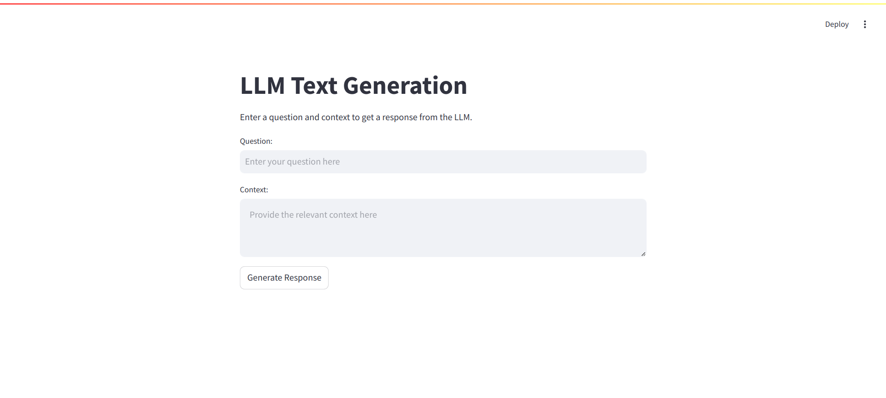
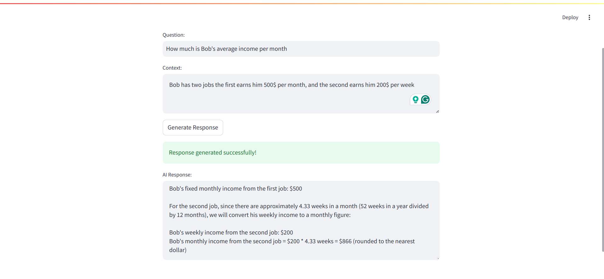
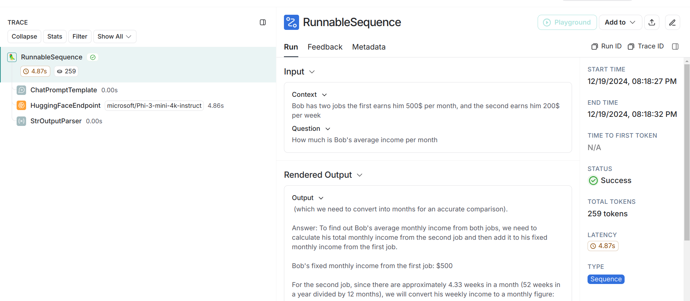

# LLMOps
## Descrition
To be completed
## Prerequisits
### Install make
```bash
sudo apt install make
```
### Install Docker
```bash
# Uninstall old versions
sudo apt-get remove docker docker-engine docker.io containerd runc
# Update system packages
sudo apt update
sudo apt upgrade -y
# Install required dependencies
sudo apt install -y ca-certificates curl gnupg lsb-release
# Add Docker's official GPG
sudo mkdir -p /etc/apt/keyrings
curl -fsSL https://download.docker.com/linux/ubuntu/gpg | sudo gpg --dearmor -o /etc/apt/keyrings/docker.gpg
# Set Up the Docker repository
echo "deb [arch=$(dpkg --print-architecture) signed-by=/etc/apt/keyrings/docker.gpg] https://download.docker.com/linux/ubuntu $(lsb_release -cs) stable" | sudo tee /etc/apt/sources.list.d/docker.list > /dev/null
# Install Docker Engine
sudo apt update
sudo apt install -y docker-ce docker-ce-cli containerd.io docker-buildx-plugin docker-compose-plugin
# Allow your user to the Docker group (avoid usin sudo)
sudo usermod -aG docker $USER
```
### Install Kind
```bash
# Download the Kind binary
curl -Lo ./kind https://kind.sigs.k8s.io/dl/latest/kind-linux-amd64
# Make it executable
chmod +x ./kind
sudo mv ./kind /usr/local/bin/kind
```
### Install Kubectl
```bash
export os="linux/amd64"
# Download latest release
curl -LO "https://dl.k8s.io/release/$(curl -sL https://dl.k8s.io/release/stable.txt)/bin/$os/kubectl"
chmod +x ./kubectl
sudo mv ./kubectl /usr/local/bin/kubectl
kubectl version --client
# To get autocompletion for the kubectl command
echo 'source <(kubectl completion bash)' >>~/.bashrc
exec bash
```
### Install Kustomize
```bash
curl -s "https://raw.githubusercontent.com/kubernetes-sigs/kustomize/master/hack/install_kustomize.sh"  | bash
chmod +x ./kustomize
sudo mv ./kustomize /usr/local/bin/kustomize
```
### Install Helm
```bash
curl https://baltocdn.com/helm/signing.asc | gpg --dearmor | sudo tee /usr/share/keyrings/helm.gpg > /dev/null
sudo apt-get install apt-transport-https --yes
echo "deb [arch=$(dpkg --print-architecture) signed-by=/usr/share/keyrings/helm.gpg] https://baltocdn.com/helm/stable/debian/ all main" | sudo tee /etc/apt/sources.list.d/helm-stable-debian.list
sudo apt-get update
sudo apt-get install helm
```
### KFP prerequisites
#### Create Python virtual environement
```bash
python3 -m venv .kubeflow
source .kubeflow/bin/activate
```
#### Install dependencies
```bash
pip install -r requirements.txt
```
## Kubeflow Installation
### Kind cluster deployment
```bash
make cluster
```
### Kubeflow platform installation
```bash
make build-kubeflow
```
Using the installation as indicated in the github `kubeflow/manifests` repo showed the following issue: [Annotation too long](https://github.com/kserve/kserve/issues/3487)
A short-term solution for this issue is to deploy kserve with server-side apply
```bash
make kserve-server-side-forcing
```
Finally deploy metallb
```bash
make kubeflow-metallb
```
To access the kubeflow platform start by exposing the service with
```bash
make expose-kubeflow
```
Now the platform is accessible on [localhost:8080](http://localhost:8080)  
You an access with the follwing credentials:
- email: `user@example.com`
- password: `12341234`

## Fine-Tuning Pipeline
### Pipeline description
  
This Kubeflow pipeline is designed to orchestrate the end-to-end workflow for fine-tuning a machine learning model. The pipeline consists of the following key components:
#### Data Fetching component
- Purpose: Retrieves the required dataset from a specified source.
- Output: The dataset is saved to the output_dataset artifact for downstream processing.
#### Data Tokenization component
- Purpose: Processes the fetched dataset by tokenizing it to prepare for model training.
- Input: Dataset from output_dataset.
- Output: Tokenized data stored in the updated output_dataset artifact.
#### Model Finetuning component
- Purpose: Fine-tunes the pre-trained model using the tokenized dataset.
- Input: Tokenized dataset from output_dataset.
- Output: The fine-tuned model is saved to the output_model_dir artifact.
#### Model Upload component
- Purpose: Uploads the fine-tuned model to a HuggingFace repository from which it can be retrieved for serving
- Input: Fine-tuned model from output_model_dir.

This pipeline ensures a streamlined approach to fine-tuning, enabling reproducibility and automation of tasks from data preprocessing to model deployment preparation.
### Run the pipeline
The pipeline output model will be stored in a HuggingFace repository hence we need to provide a HF access token.  
Go to your HuggingFace profile and generate an access token, ensure that the token has a write permission.  
Then save the token in an environment variable called `HF_TOKEN` and define your HF repository name in an environment variable called `HF_REPO` like following:
```bash
export HF_TOKEN="<your-hf-access-token>"
export HF_REPO="<your-hf-username>/<repo-name>"
```
Run the following command to create a Kubernetes secret that is going to be used by the model_upload component
```bash
cd llm-pipelines && make create-secret
```
Before running the pipeline make sure you are inside the python virtual environment and that the requirements are installed.  
Run the pipeline (make sure you are in the root of the project directory)
```bash
python3 -m llm-pipelines.fine-tune-pipeline
```

## LLM Inference
This LLM inference endpoint, consists of two primary components: the LLM API and the frontend UI. The endpoint is designed to answer user questions based on a provided context by leveraging a language model (LLM) from Hugging Face, integrated with LangChain and LangSmith for enhanced functionality and telemetry.
### Architecture Components
#### LLM API
Description:  
- Serves a Hugging Face-based language model.  
- Utilizes LangChain for chaining the LLM with:  
  - A prompt to define the task.  
  - An strOutputParser to structure the response.  
- Answers questions based on a given context.  
- Integrates with LangSmith for telemetry to monitor and analyze the model’s performance.  

Features:
- Contextual Question Answering: Generates responses based on a context and a question.  
- Telemetry: Sends model performance metrics and logs to the LangSmith platform.  

Deployment:  
- Deployed using KServe's InferenceService.  

Configuration:  
- ConfigMap: Used to pass the model name to the inference service.  
- Secrets:  
  - Hugging Face access token.  
  - LangSmith configuration variables and token.  

Security:
- Istio AuthorizationPolicy: Allow access from the UI to the LLM API.
#### Frontend UI
Description:  
- Provides an intuitive interface for users to:  
  - Input a context.  
  - Submit questions.  
  - View model-generated responses.  
- Acts as the interaction layer for the inference endpoint.  

Deployment:
- Deployed in the same Kubernetes namespace as the API (kubeflow-user-example-com).  

Configuration:
- ConfigMap: Used to pass the model API URL to the UI.  

Security:
- Istio AuthorizationPolicy: Allow external interaction with the UI.
### Workflow
User Interaction:
- The user accesses the frontend UI and inputs a context and a question.
- The UI sends the input to the LLM API.  

Inference Process:
- The LLM API processes the input using:
  - The provided context and question.  
  - The configured prompt and strparser via LangChain.  
- The LLM generates a response and returns it to the UI.  

Telemetry:  
- LangSmith collects telemetry data for:  
  - Model performance.  
  - User interaction metrics.  

Response Display:  
- The UI displays the response to the user.  

### Run the Endpoint
Before running the enpoint you need to have the following environement variables set
```bash
export HF_TOKEN="<your-huggingface-token>"
export LANGCHAIN_TRACING_V2=true
export LANGCHAIN_ENDPOINT="<langchain-endpoint>"
export LANGCHAIN_API_KEY="<your-langsmith-api-key>"
export LANGCHAIN_PROJECT="<your-langsmith-project-name>"
```
To get these env vars, you need to log into your LangSmith account and create a new project.  
Once these variables are set you can deploy the endpoints with the follwing commands:
```bash
cd llm-endpoint
make api-deploy
make ui-deploy
```
Now you can check the address on which the UI is served using the following command
```bash
kubectl get svc llm-ui -n kubeflow-user-example-com -o jsonpath='{.status.loadBalancer.ingress[0].ip}'
```
Log into the UI

Enter your question and the context, then click `Generate Response`

Now you can check your LangSmith project for model telemetry


## Troubleshooting
**Issue1**: The browser will automatically save the access token to the kubeflow platform, this might raise an issue when you redeploy the cluster as the token changes. To solve this you need to clear the cashed data, in particular the cookies cashed data: right click on the web app page > inspect > Application > look for the cookies and delete the saved data  
**Issue2**: [Annotation is too long](https://github.com/kserve/kserve/issues/3487) 