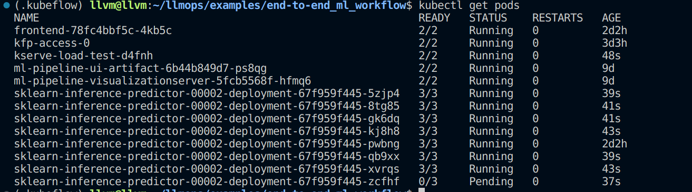

# End to End ML Workflow
In this example we leverage the different kubeflow components to orchestrate an end to end ML workflow: data-fetching -> data-processing -> model-training -> model-selection-and-versioning -> model-deployment -> performing-inference -> monitoring.  
We also explore the autoscaling feature in Kserve
## Model-training pipeline
### Pipeline description
  

This Kubeflow pipeline is designed to train multiple machine learning models. The pipeline consists of the following key components:
#### Data Fetching component
- Purpose: Retrieves the required dataset from a specified source.
- Output: The dataset is saved to the iris_dataset artifact for downstream processing.
#### Data Processing component
- Input: iris_dataset from the upstream data-fetching component.
- Output: the processed dataset is saved to normalized_iris_dataset 
#### Model training
- Purpose: Train multiple KNN models, with different K values, in a prallelized manner
- Input: normalized_iris_dataset from the upstream data-normalization component
- Output: trained model
### Run the pipeline
Before running the pipeline make sure you are inside the python virtual environment and that the requirements are installed.  
Run the pipeline (make sure you are in the path: /examples/end-to-end_ml_workflow)
```bash
python3 -m main training_pipeline
```
## Model Selection pipeline
### Pipeline description
  

This is designed to select the best model among the trained models with a specific version, once the model is identified it pushes it to a kubernetes pvc, from where it can be served.  
The pipeline has the following components:
#### Create PVC component
This component creates a kubernetes pvc, in which the best model will be stored. Once the model is stored in the pvc, Kserve can reference it to serve the model.
#### Model selection component
Based on the accuracy metric, this component identifies the best model among those that have a specific version.  
After selecting the model, it pushes it to the pvc created in the previous component.
### Run the pipeline
Before running the pipeline make sure you are inside the python virtual environment and that the requirements are installed.  
Run the pipeline (make sure you are in the path: /examples/end-to-end_ml_workflow)
```bash
python3 -m main model_selection_pipeline
```

## Inference
### Using a UI
Once we have our selected model inside the pvc `model-pvc`, we can directly serve it using Kserve
```bash
make inference
```
You can test the inference endpoint by using the small app we build for this specific purpose
```bash
cd frontend
make all
```
If everything ran successfully and if metallb is installed, you should be able to access the frontend UI on the address `172.18.255.200:8081`, to double check this address run
```bash
kubectl get svc -n kubeflow-user-example-com frontend
```


Now open the `/predict` tab  


Enter the feature values  


And click `Submit`  
You should have something similar to this


### Testing Kserve autoscaling
We use `hey` to send hundreds of requests to the inference service endpoint concurrently.  
To test this we run a kubernetes job
```bash
make test_autoscaling
```
Once the job is running we can first check that kserve automatically launches new replicas of the inference pod

  

We can also Check the memory and CPU usage on the Grafana dashboard  

  

Finally we can see the logs of the job we've run, to get some statistics about the requests made  


